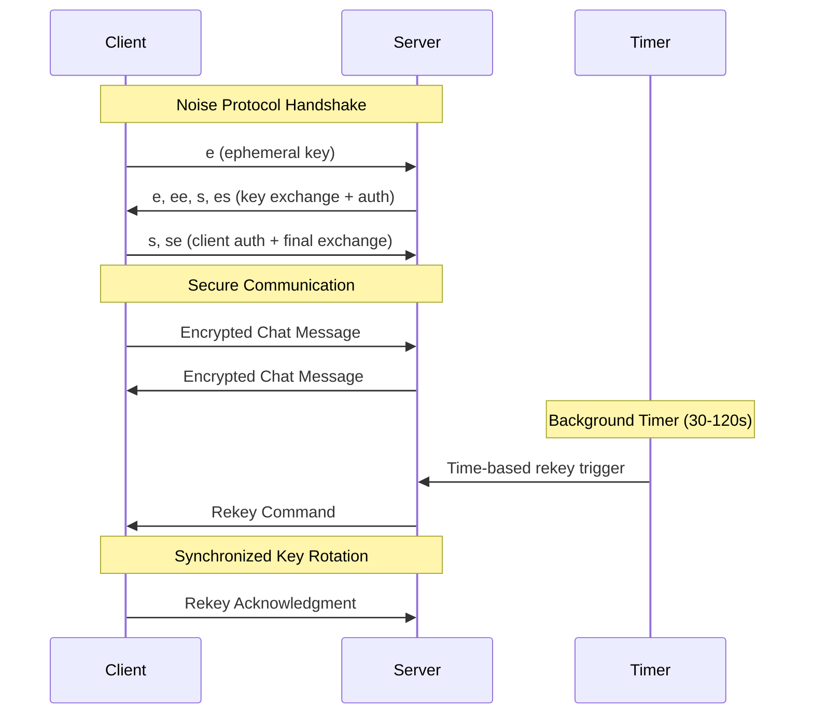

# 🔐 Secure WebSocket Chat

[](https://www.rust-lang.org)
[](https://opensource.org/licenses/MIT)
[](https://noiseprotocol.org)
[](https://tools.ietf.org/html/rfc6455)

A **production-ready** secure bidirectional chat application built with Rust using WebSockets and the **Noise Protocol** for end-to-end encryption with **unpredictable time-based key rotation** that provides protection even during idle periods.

## ✨ Key Features

- 🔐 **Military-Grade Encryption**: Noise Protocol with `Noise_XXpsk2_25519_AESGCM_SHA256`
- ⏰ **Time-Based Random Rekeying**: Automatic key rotation every 30-120 seconds
- 🛡️ **Idle Period Protection**: Security maintained even during inactivity
- 🎲 **Unpredictable Security**: Random timing prevents all timing analysis attacks
- 💬 **Real-Time Chat**: Bidirectional encrypted communication
- 🚀 **High Performance**: Built with Tokio async runtime
- 📱 **Cross-Platform**: Works on Windows, macOS, and Linux

## 🔒 Security Features

| Feature | Description |
|---------|-------------|
| **End-to-End Encryption** | All messages encrypted using AES-GCM |
| **Mutual Authentication** | Both client and server authenticate each other |
| **Pre-Shared Key** | Additional security layer with PSK authentication |
| **Perfect Forward Secrecy** | Session keys derived from ephemeral DH exchange |
| **Time-Based Rekeying** | Keys rotate on unpredictable time schedule |
| **Idle Protection** | Security maintained during inactive periods |
| **Timing Attack Immunity** | Completely unpredictable rekeying intervals |

## 🛠️ Technology Stack

- **Language**: [Rust](https://www.rust-lang.org) 1.70+
- **Async Runtime**: [Tokio](https://tokio.rs)
- **WebSocket**: [tokio-tungstenite](https://github.com/snapview/tokio-tungstenite)
- **Encryption**: [Snow](https://github.com/mcginty/snow) (Noise Protocol)
- **Serialization**: [Serde](https://serde.rs)
- **Random Generation**: [rand](https://github.com/rust-random/rand)

## 📦 Installation

### Prerequisites

- **Rust** 1.70 or later
- **Cargo** package manager

### Quick Start

1. **Clone the repository**:
```bash
git clone https://github.com/yourusername/secure-websocket-chat.git
cd secure-websocket-chat
```

2. **Build the project**:
```bash
cargo build --release
```

3. **Run the server**:
```bash
cargo run --bin server
```

4. **Run the client** (in another terminal):
```bash
cargo run --bin client
```

## 🎮 Usage

### Server Commands

```bash
# Start the server
cargo run --bin server

# Server will display:
🚀 Secure WebSocket server listening on: 127.0.0.1:8080
🔐 Using Noise protocol: Noise_XXpsk2_25519_AESGCM_SHA256
⏰ Time-based random rekeying enabled: 30-120 seconds
```

### Client Commands

```bash
# Connect to server
cargo run --bin client

# Available commands:
> Hello, world!          # Send a message
> status                 # Show connection statistics
> quit                   # Disconnect gracefully
```

### Live Example Session

**Server Terminal:**
```
🚀 Secure WebSocket server listening on: 127.0.0.1:8080
🔐 Using Noise protocol: Noise_XXpsk2_25519_AESGCM_SHA256
⏰ Time-based random rekeying enabled: 30-120 seconds
📱 New connection from: 127.0.0.1:54321
✅ WebSocket connection established!
🤝 Starting Noise handshake...
🎲 Random rekey interval set: 75 seconds
🔐 Secure channel established!
💬 Type messages to send to client:
> Hello from secure server!
📤 You: Hello from secure server!
📨 Client: Hi server! This connection is encrypted!
⏰ Time-based rekey triggered!
🔄 Server performing time-based key rotation #1 (total messages: 4)
✅ Key rotation completed - next rekey in 42 seconds
```

**Client Terminal:**
```
🔗 Connecting to WebSocket server at: ws://127.0.0.1:8080
⏰ Server-controlled time-based random rekeying enabled
✅ Connected to server!
🤝 Starting Noise handshake...
🔐 Secure channel established!
💬 Type messages to send to server (or 'status' for info):
📨 Server: Hello from secure server!
> Hi server! This connection is encrypted!
📤 You: Hi server! This connection is encrypted!
⏰ Received time-based rekey command from server
🔄 Client performing time-based key rotation #1 (total messages: 4)
✅ Client key rotation completed - synchronized with server
> status
📊 Status - Messages: 4 | Rekeys: 1
```

## 🔧 Configuration

### Rekey Timing Configuration

Adjust random rekeying intervals in `src/server.rs`:

```rust
const MIN_REKEY_INTERVAL_SECS: u64 = 30;  // Minimum seconds between rekeys
const MAX_REKEY_INTERVAL_SECS: u64 = 120; // Maximum seconds between rekeys
```

### Security Configurations

| Setting | High Security | Balanced | Performance |
|---------|---------------|----------|-------------|
| **Min Interval** | 15 seconds | 30 seconds | 60 seconds |
| **Max Interval** | 60 seconds | 120 seconds | 300 seconds |
| **Use Case** | Critical systems | General use | Low-latency apps |

### Timer Check Frequency

Modify background timer check interval:

```rust
let mut interval = tokio::time::interval(Duration::from_secs(5)); // Check every 5 seconds
```

## 🏗️ Architecture

### System Overview

```
┌─────────────┐     ┌─────────────┐     ┌─────────────┐
│   Client    │────▶│  WebSocket  │────▶│   Server    │
│             │     │  (Secure)   │     │             │
└─────────────┘     └─────────────┘     └─────────────┘
       │                    │                    │
       ▼                    ▼                    ▼
┌─────────────┐     ┌─────────────┐     ┌─────────────┐
│ Noise Proto │     │ AES-GCM     │     │ Time-Based  │
│ Handshake   │     │ Encryption  │     │ Rekeying    │
└─────────────┘     └─────────────┘     └─────────────┘
```

### Security Flow



## 🛡️ Security Analysis

### Threat Model

| Threat | Protection | Status |
|--------|------------|--------|
| **Eavesdropping** | AES-GCM encryption | ✅ Protected |
| **MITM Attacks** | Mutual authentication | ✅ Protected |
| **Replay Attacks** | Noise protocol nonces | ✅ Protected |
| **Timing Attacks** | Random rekey intervals | ✅ Protected |
| **Key Compromise** | Perfect Forward Secrecy | ✅ Protected |
| **Idle Attacks** | Time-based rekeying | ✅ Protected |

### Cryptographic Guarantees

- **Confidentiality**: AES-256-GCM encryption
- **Authenticity**: AEAD authentication tags
- **Integrity**: Cryptographic message authentication
- **Forward Secrecy**: Ephemeral key exchange + regular rotation
- **Non-Repudiation**: Mutual authentication with static keys

## 🧪 Development

### Project Structure

```
src/
├── server.rs          # WebSocket server with time-based rekeying
├── client.rs          # WebSocket client with sync handling
└── lib.rs            # Common utilities (optional)

Cargo.toml            # Dependencies and metadata
README.md             # This documentation
.gitignore           # Git ignore patterns
LICENSE              # MIT license
```

### Building from Source

```bash
# Development build
cargo build

# Release build (optimized)
cargo build --release

# Run tests
cargo test

# Check code formatting
cargo fmt --check

# Run linter
cargo clippy
```

### Dependencies

```toml
[dependencies]
tokio = { version = "1.0", features = ["full"] }
tokio-tungstenite = "0.20"
futures-util = "0.3"
serde = { version = "1.0", features = ["derive"] }
serde_json = "1.0"
snow = "0.9"              # Noise protocol implementation
hex = "0.4"               # Hexadecimal encoding
rand = "0.8"              # Random number generation
```

## 🔍 Security Notes

⚠️ **Important Security Considerations**

### Production Deployment

1. **🔑 Key Management**: Replace hardcoded PSK with proper key distribution
2. **🌐 Network Security**: Use TLS for transport layer security
3. **🛡️ Authentication**: Implement robust user authentication
4. **📊 Monitoring**: Add logging and intrusion detection
5. **⚡ Performance**: Monitor rekeying frequency for network impact
6. **🔒 Key Storage**: Secure storage for static keys

### Current Limitations

- Uses hardcoded pre-shared key (demo purposes only)
- Single client connection (can be extended for multiple clients)
- No persistent storage (messages are not saved)
- Basic error handling (can be enhanced for production)

## 🤝 Contributing

We welcome contributions! Please see our [Contributing Guidelines](CONTRIBUTING.md) for details.

### Development Workflow

1. Fork the repository
2. Create a feature branch (`git checkout -b feature/amazing-feature`)
3. Make your changes
4. Add tests for new functionality
5. Ensure all tests pass (`cargo test`)
6. Format code (`cargo fmt`)
7. Run linter (`cargo clippy`)
8. Commit changes (`git commit -m 'Add amazing feature'`)
9. Push to branch (`git push origin feature/amazing-feature`)
10. Open a Pull Request

## 📋 Changelog

### v1.0.0 (Latest)
- ✅ Time-based random rekeying implementation
- ✅ Idle period protection
- ✅ Enhanced security with unpredictable intervals
- ✅ Real-time status tracking
- ✅ Comprehensive documentation

### v0.3.0
- ✅ Server-controlled rekeying
- ✅ Control message protocol
- ✅ Enhanced error handling

### v0.2.0
- ✅ Fixed threshold-based rekeying
- ✅ Message counting system
- ✅ Basic status indicators

### v0.1.0
- ✅ Basic WebSocket communication
- ✅ Noise protocol integration
- ✅ JSON message format

## 📞 Support

- **Issues**: [GitHub Issues](https://github.com/yourusername/secure-websocket-chat/issues)
- **Discussions**: [GitHub Discussions](https://github.com/yourusername/secure-websocket-chat/discussions)
- **Security**: For security vulnerabilities, please email security@yourproject.com

## 🙏 Acknowledgments

- [Noise Protocol](https://noiseprotocol.org) for the cryptographic framework
- [Snow](https://github.com/mcginty/snow) for the Rust Noise implementation
- [Tokio](https://tokio.rs) for the async runtime
- [WebSocket RFC 6455](https://tools.ietf.org/html/rfc6455) for the communication protocol

## 📖 Further Reading

- [Noise Protocol Specification](https://noiseprotocol.org/noise.html)
- [WebSocket Security](https://developer.mozilla.org/en-US/docs/Web/API/WebSockets_API/Writing_WebSocket_servers)
- [Rust Async Programming](https://rust-lang.github.io/async-book/)
- [Cryptographic Best Practices](https://github.com/veorq/cryptocoding)

---

## 📄 License

This project is licensed under the MIT License - see the [LICENSE](#license-text) section below for details.

### License Text

```
MIT License

Copyright (c) 2024 Secure WebSocket Chat Contributors

Permission is hereby granted, free of charge, to any person obtaining a copy
of this software and associated documentation files (the "Software"), to deal
in the Software without restriction, including without limitation the rights
to use, copy, modify, merge, publish, distribute, sublicense, and/or sell
copies of the Software, and to permit persons to whom the Software is
furnished to do so, subject to the following conditions:

The above copyright notice and this permission notice shall be included in all
copies or substantial portions of the Software.

THE SOFTWARE IS PROVIDED "AS IS", WITHOUT WARRANTY OF ANY KIND, EXPRESS OR
IMPLIED, INCLUDING BUT NOT LIMITED TO THE WARRANTIES OF MERCHANTABILITY,
FITNESS FOR A PARTICULAR PURPOSE AND NONINFRINGEMENT. IN NO EVENT SHALL THE
AUTHORS OR COPYRIGHT HOLDERS BE LIABLE FOR ANY CLAIM, DAMAGES OR OTHER
LIABILITY, WHETHER IN AN ACTION OF CONTRACT, TORT OR OTHERWISE, ARISING FROM,
OUT OF OR IN CONNECTION WITH THE SOFTWARE OR THE USE OR OTHER DEALINGS IN THE
SOFTWARE.
```

---

<div align="center">

**Built with ❤️ and Rust**

[⭐ Star this repo](https://github.com/yourusername/secure-websocket-chat) if you find it useful!

</div> 